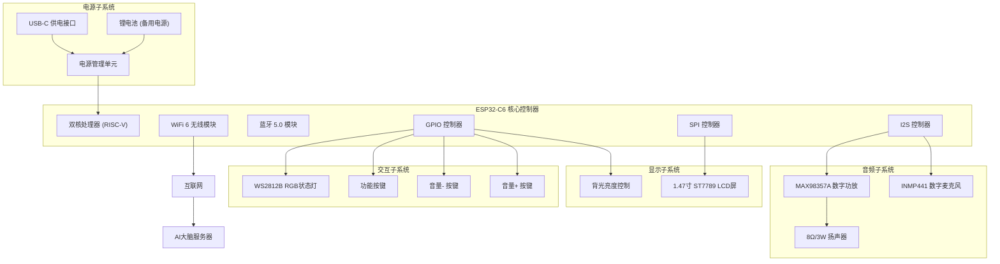

# Choomi硬件端设计文档

## 概述

本文档详细描述了Choomi桌面宠物硬件端的技术设计方案。硬件端基于ESP32-C6开发板，集成音频采集播放、LCD显示、按键交互和网络通信功能，作为纯执行器与AI大脑服务器协同工作。

**需求覆盖说明：** 本设计文档完全满足 `requirements.md` 中定义的所有10项功能需求，包括硬件连接与电路设计、WiFi网络连接、LCD显示控制、麦克风音频采集、扬声器音频播放、按键交互、WebSocket通信、RGB状态指示灯、设备注册与身份验证以及设备状态管理功能。

## 架构设计

### 系统架构图



### 文本版系统架构图（备选显示）

```
┌─────────────────────────────────────────────────────────────────┐
│                        Choomi硬件系统架构                        │
├─────────────────────────────────────────────────────────────────┤
│                                                                 │
│  ┌─────────────────┐    ┌─────────────────┐    ┌─────────────────┐ │
│  │   音频子系统    │    │   显示子系统    │    │   交互子系统    │ │
│  ├─────────────────┤    ├─────────────────┤    ├─────────────────┤ │
│  │ INMP441麦克风   │    │ ST7789 LCD      │    │ 音量+按键(GPIO1)│ │
│  │ MAX98357A功放   │    │ 背光控制(GPIO22)│    │ 音量-按键(GPIO2)│ │
│  │ 8Ω/3W扬声器    │    │                 │    │ 功能按键(GPIO3) │ │
│  │                 │    │                 │    │ WS2812B RGB LED │ │
│  └─────────────────┘    └─────────────────┘    └─────────────────┘ │
│           │                       │                       │        │
│           │                       │                       │        │
│  ┌─────────────────────────────────────────────────────────────────┐ │
│  │                      ESP32-C6核心控制器                        │ │
│  ├─────────────────────────────────────────────────────────────────┤ │
│  │ • 双核处理器 (RISC-V)                                          │ │
│  │ • WiFi 6模块 ──────────────────→ 互联网 ──→ AI大脑服务器      │ │
│  │ • 蓝牙5.0模块                                                  │ │
│  │ • I2S控制器 ──→ 音频输入/输出                                  │ │
│  │ • SPI控制器 ──→ LCD显示控制                                    │ │
│  │ • GPIO控制器 ──→ 按键输入 + RGB LED控制                       │ │
│  └─────────────────────────────────────────────────────────────────┘ │
│                                   │                                 │
│  ┌─────────────────────────────────────────────────────────────────┐ │
│  │                        电源子系统                              │ │
│  ├─────────────────────────────────────────────────────────────────┤ │
│  │ • USB-C供电接口                                                │ │
│  │ • 锂电池(可选)                                                 │ │
│  │ • 电源管理单元                                                 │ │
│  │ • 电池电压检测(GPIO9)                                          │ │
│  └─────────────────────────────────────────────────────────────────┘ │
│                                                                 │
└─────────────────────────────────────────────────────────────────┘

数据流向：
音频输入：麦克风 → I2S → ESP32-C6 → WiFi → 服务器
音频输出：服务器 → WiFi → ESP32-C6 → I2S → 功放 → 扬声器
显示输出：服务器 → WiFi → ESP32-C6 → SPI → LCD
用户交互：按键 → GPIO → ESP32-C6 → WiFi → 服务器
状态指示：ESP32-C6 → GPIO → RGB LED
```

### 硬件分层架构

1. **硬件抽象层（HAL）**：ESP-IDF提供的硬件抽象接口
2. **驱动层**：各硬件模块的驱动程序
3. **服务层**：音频、显示、网络等功能服务
4. **应用层**：主控逻辑和通信协议处理

## 硬件连接设计

> **对应需求：** [需求1：硬件连接与电路设计](requirements.md#需求1硬件连接与电路设计) - 本章节完全满足硬件连接、引脚分配、电路设计和电源管理的所有技术规格和验收标准。

### ESP32-C6引脚分配表

| 功能模块 | 信号名 | ESP32-C6引脚 | 方向 | 说明 |
|----------|--------|--------------|------|------|
| **I2S音频** | I2S_BCLK | GPIO4 | OUT | I2S位时钟 |
| | I2S_WS | GPIO5 | OUT | I2S字选择时钟 |
| | I2S_DIN | GPIO18 | IN | 麦克风数据输入 |
| | I2S_DOUT | GPIO19 | OUT | 扬声器数据输出 |
| **SPI显示** | SPI_CLK | GPIO7 | OUT | SPI时钟信号 (SCL) |
| | SPI_MOSI | GPIO6 | OUT | SPI数据输出 (SDA) |
| | LCD_CS | GPIO14 | OUT | LCD片选信号 |
| | LCD_DC | GPIO15 | OUT | LCD数据/命令选择 |
| | LCD_RST | GPIO21 | OUT | LCD复位信号 |
| | LCD_BL | GPIO22 | OUT | LCD背光控制 |
| **按键输入** | BTN_VOL_UP | GPIO1 | IN | 音量增加按键 |
| | BTN_VOL_DOWN | GPIO2 | IN | 音量减少按键 |
| | BTN_FUNC | GPIO3 | IN | 功能按键 |
| **电源管理** | BAT_ADC | GPIO9 | IN | 电池电压检测 |
| **状态指示** | RGB_LED | GPIO8 | OUT | WS2812B RGB状态指示灯 |
| **扩展接口** | SPARE_1 | GPIO20 | I/O | 预留扩展引脚1 |
| | SPARE_2 | GPIO23 | I/O | 预留扩展引脚2 |

**注意事项：**
- GPIO0为ESP32-C6的启动引脚，启动时需要保持高电平，因此不用作按键输入
- 可用IO引脚：GPIO1,GPIO2,GPIO3,GPIO4,GPIO5,GPIO8,GPIO9,GPIO18,GPIO19,GPIO20,GPIO23
- LCD接口已按实际硬件连接进行分配：D/C→GPIO15, CS→GPIO14, SCL→GPIO7, SDA→GPIO6, RESET→GPIO21, BLK→GPIO22

### 麦克风连接电路

```
INMP441数字麦克风连接：
┌─────────────┐    ┌──────────────┐
│   INMP441   │    │   ESP32-C6   │
├─────────────┤    ├──────────────┤
│ VDD    ─────┼────┤ 3.3V         │
│ GND    ─────┼────┤ GND          │
│ SCK    ─────┼────┤ GPIO4 (BCLK) │
│ WS     ─────┼────┤ GPIO5 (WS)   │
│ SD     ─────┼────┤ GPIO9 (DIN) │
│ L/R    ─────┼────┤ GND (左声道) │
└─────────────┘    └──────────────┘
```

### 扬声器连接电路

```
MAX98357A功放模块连接：
┌─────────────┐    ┌──────────────┐
│  MAX98357A  │    │   ESP32-C6   │
├─────────────┤    ├──────────────┤
│ VIN    ─────┼────┤ 5V (USB)     │
│ GND    ─────┼────┤ GND          │
│ BCLK   ─────┼────┤ GPIO18        │
│ LRCLK  ─────┼────┤ GPIO19        │
│ DIN    ─────┼────┤ GPIO20 (DOUT)│
│ GAIN   ─────┼────┤ GND (9dB增益)│
│ SD     ─────┼────┤ 3.3V (使能)  │
├─────────────┤    └──────────────┘
│ OUT+   ─────┼────┐
│ OUT-   ─────┼────┤ 8Ω/3W扬声器
└─────────────┘    └──────────────
```

### LCD屏幕连接电路

```
1.47寸ST7789 LCD连接：
┌─────────────┐    ┌──────────────┐
│   ST7789    │    │   ESP32-C6   │
├─────────────┤    ├──────────────┤
│ VCC    ─────┼────┤ 3.3V         │
│ GND    ─────┼────┤ GND          │
│ SCL    ─────┼────┤ GPIO7 (CLK)  │
│ SDA    ─────┼────┤ GPIO6 (MOSI) │
│ CS     ─────┼────┤ GPIO14       │
│ DC     ─────┼────┤ GPIO15       │
│ RST    ─────┼────┤ GPIO21       │
│ BL     ─────┼────┤ GPIO22       │
└─────────────┘    └──────────────┘
```

### RGB状态指示灯连接电路

```
WS2812B-0807 RGB LED连接：
┌─────────────┐    ┌──────────────┐
│  WS2812B    │    │   ESP32-C6   │
├─────────────┤    ├──────────────┤
│ VDD    ─────┼────┤ 3.3V         │
│ GND    ─────┼────┤ GND          │
│ DI     ─────┼────┤ GPIO8 (DIN)  │
│ DO     ─────┼────┤ (可级联更多LED)│
└─────────────┘    └──────────────┘

注意：WS2812B-0807为小封装RGB LED，支持24位真彩色控制
```

### 按键输入连接电路

```
按键输入系统连接：
┌─────────────┐    ┌──────────────┐
│    按键     │    │   ESP32-C6   │
├─────────────┤    ├──────────────┤
│ 音量+按键   ─────┼────┤ GPIO1 (内部上拉)│
│ 音量-按键   ─────┼────┤ GPIO2 (内部上拉)│
│ 功能按键    ─────┼────┤ GPIO3 (内部上拉)│
│ 公共端      ─────┼────┤ GND          │
└─────────────┘    └──────────────┘

注意：GPIO0为启动引脚，启动时需要保持高电平，因此改用GPIO1-3作为按键输入
```

## 组件和接口设计

### 音频处理组件

#### 麦克风采集模块

> **对应需求：** [需求4：麦克风音频采集功能](requirements.md#需求4麦克风音频采集功能) - 实现INMP441数字麦克风的音频采集，支持16kHz采样率和实时音频处理。

```c
typedef struct {
    i2s_port_t port;
    uint32_t sample_rate;
    uint8_t bits_per_sample;
    i2s_channel_fmt_t channel_format;
    size_t buffer_size;
    QueueHandle_t audio_queue;
} mic_config_t;

// 接口函数
esp_err_t mic_init(mic_config_t *config);
esp_err_t mic_start_recording(void);
esp_err_t mic_stop_recording(void);
size_t mic_read_data(uint8_t *buffer, size_t size, TickType_t timeout);
```

#### 扬声器播放模块

> **对应需求：** [需求5：扬声器音频播放功能](requirements.md#需求5扬声器音频播放功能) - 实现MAX98357A功放驱动的音频播放，支持音量调节和多种音频格式。

```c
typedef struct {
    i2s_port_t port;
    uint32_t sample_rate;
    uint8_t bits_per_sample;
    uint8_t volume_level;
    QueueHandle_t play_queue;
} speaker_config_t;

// 接口函数
esp_err_t speaker_init(speaker_config_t *config);
esp_err_t speaker_play_data(uint8_t *data, size_t size);
esp_err_t speaker_set_volume(uint8_t volume);
esp_err_t speaker_stop(void);
```

### 显示控制组件

#### LCD驱动模块
```c
typedef struct {
    spi_host_device_t spi_host;
    int pin_cs;
    int pin_dc;
    int pin_rst;
    int pin_bl;
    uint16_t width;
    uint16_t height;
    uint8_t brightness;
} lcd_config_t;

// 接口函数
esp_err_t lcd_init(lcd_config_t *config);
esp_err_t lcd_draw_bitmap(uint16_t x, uint16_t y, uint16_t w, uint16_t h, uint16_t *data);
esp_err_t lcd_fill_screen(uint16_t color);
esp_err_t lcd_set_brightness(uint8_t brightness);
esp_err_t lcd_display_animation(animation_frame_t *frames, size_t frame_count);
esp_err_t lcd_draw_text(uint16_t x, uint16_t y, const char *text, uint16_t color);
esp_err_t lcd_draw_pet_emotion(emotion_type_t emotion);
esp_err_t lcd_display_status_screen(device_status_t status);
esp_err_t lcd_display_wifi_config_screen(void);
esp_err_t lcd_display_error_screen(const char *error_msg);
esp_err_t lcd_display_volume_indicator(uint8_t volume);
esp_err_t lcd_display_battery_status(uint8_t battery_level, bool charging);
esp_err_t lcd_clear_screen(void);
esp_err_t lcd_display_boot_screen(void);
esp_err_t lcd_display_listening_animation(void);
esp_err_t lcd_display_speaking_animation(void);
esp_err_t lcd_display_thinking_animation(void);
esp_err_t lcd_display_wifi_scanning_animation(void);
esp_err_t lcd_display_connecting_animation(void);
esp_err_t lcd_update_time_display(const char *time_str);
esp_err_t lcd_display_notification(const char *message, uint32_t duration_ms);
esp_err_t lcd_display_pet_idle_animation(void);
esp_err_t lcd_display_pet_happy_animation(void);
esp_err_t lcd_display_pet_sad_animation(void);
esp_err_t lcd_display_pet_angry_animation(void);
esp_err_t lcd_display_pet_surprised_animation(void);
esp_err_t lcd_display_pet_sleeping_animation(void);
```

#### RGB状态指示灯模块

> **对应需求：** [需求8：RGB状态指示灯功能](requirements.md#需求8rgb状态指示灯功能) - 实现WS2812B RGB LED的状态指示，支持多种颜色和动画效果。本设计完全满足需求8的验收标准：支持7种基本颜色显示、5种动画效果、设备状态实时指示和亮度调节功能。

```c
typedef struct {
    int pin_data;
    uint8_t led_count;
    uint32_t frequency;
} rgb_led_config_t;

typedef enum {
    RGB_COLOR_RED = 0xFF0000,
    RGB_COLOR_GREEN = 0x00FF00,
    RGB_COLOR_BLUE = 0x0000FF,
    RGB_COLOR_YELLOW = 0xFFFF00,
    RGB_COLOR_PURPLE = 0xFF00FF,
    RGB_COLOR_CYAN = 0x00FFFF,
    RGB_COLOR_WHITE = 0xFFFFFF,
    RGB_COLOR_OFF = 0x000000
} rgb_color_t;

typedef enum {
    RGB_EFFECT_SOLID,
    RGB_EFFECT_BREATHING,
    RGB_EFFECT_BLINKING,
    RGB_EFFECT_RAINBOW,
    RGB_EFFECT_FADE
} rgb_effect_t;

// 接口函数
esp_err_t rgb_led_init(rgb_led_config_t *config);
esp_err_t rgb_led_set_color(uint32_t color);
esp_err_t rgb_led_set_effect(rgb_effect_t effect, uint32_t color, uint32_t duration_ms);
esp_err_t rgb_led_set_brightness(uint8_t brightness);
esp_err_t rgb_led_off(void);
esp_err_t rgb_led_indicate_status(device_status_t status);
```

### 输入控制组件

#### 按键输入模块

> **对应需求：** [需求6：按键交互功能](requirements.md#需求6按键交互功能) - 实现3个轻触按键的输入处理，支持短按、长按和超长按功能。

```c
typedef enum {
    BTN_VOL_UP = 0,
    BTN_VOL_DOWN,
    BTN_FUNC,
    BTN_MAX
} button_id_t;

typedef enum {
    BTN_EVENT_PRESS,
    BTN_EVENT_RELEASE,
    BTN_EVENT_SHORT_PRESS,
    BTN_EVENT_LONG_PRESS,
    BTN_EVENT_SUPER_LONG_PRESS
} button_event_t;

typedef struct {
    button_id_t id;
    int gpio_pin;
    bool active_level;
    uint32_t debounce_ms;
    uint32_t long_press_ms;
    uint32_t super_long_press_ms;
} button_config_t;

typedef void (*button_callback_t)(button_id_t id, button_event_t event);

// 接口函数
esp_err_t button_init(button_config_t *configs, size_t count);
esp_err_t button_register_callback(button_callback_t callback);
esp_err_t button_get_state(button_id_t id, bool *pressed);
esp_err_t button_enable_interrupt(button_id_t id, bool enable);
```

### 网络通信组件

#### WiFi管理模块

> **对应需求：** [需求2：WiFi网络连接功能](requirements.md#需求2wifi网络连接功能) - 实现WiFi连接、断线重连、信号强度监测和SmartConfig配置功能。

```c
typedef struct {
    char ssid[32];
    char password[64];
    wifi_auth_mode_t auth_mode;
    uint8_t max_retry;
    EventGroupHandle_t wifi_event_group;
} wifi_config_t;

// 接口函数
esp_err_t wifi_init(void);
esp_err_t wifi_connect(wifi_config_t *config);
esp_err_t wifi_disconnect(void);
wifi_ap_record_t* wifi_scan_networks(uint16_t *count);
int8_t wifi_get_rssi(void);
bool wifi_is_connected(void);
esp_err_t wifi_start_smartconfig(void);
esp_err_t wifi_stop_smartconfig(void);
```

#### WebSocket客户端模块

> **对应需求：** [需求7：WebSocket通信功能](requirements.md#需求7websocket通信功能) - 实现与AI大脑服务器的实时通信，包括连接管理、消息收发和自动重连机制。

```c
typedef struct {
    char uri[256];
    char device_id[64];
    char access_token[128];
    esp_websocket_client_handle_t client;
    QueueHandle_t message_queue;
    SemaphoreHandle_t send_mutex;
    bool authenticated;
    uint64_t token_expire_time;
} websocket_config_t;

// 接口函数
esp_err_t websocket_init(websocket_config_t *config);
esp_err_t websocket_connect(void);
esp_err_t websocket_send_json(cJSON *json_data);
esp_err_t websocket_send_binary(uint8_t *data, size_t size);
cJSON* websocket_receive_json(TickType_t timeout);
esp_err_t websocket_authenticate(const char *device_id, const char *token);
esp_err_t websocket_refresh_token(void);
bool websocket_is_authenticated(void);
```

### 安全认证组件

## LCD显示内容设计

> **对应需求：** [需求3：LCD显示控制功能](requirements.md#需求3lcd显示控制功能) - 本章节详细设计了LCD显示的所有状态界面、动画效果、颜色规范和交互反馈，完全满足显示控制的技术规格和验收标准。

### 显示屏规格
- **屏幕尺寸**: 1.47寸 ST7789 TFT LCD
- **分辨率**: 172x320像素
- **颜色深度**: 16位真彩色 (65536色)
- **显示方向**: 竖屏显示
- **刷新率**: 60Hz
- **背光**: PWM调光，支持亮度调节

### 界面布局设计

#### 主界面布局结构
```
┌─────────────────────┐ ← 172px宽
│    状态栏区域       │ ← 顶部30px高
├─────────────────────┤
│                     │
│    宠物显示区域     │ ← 中间200px高
│                     │
├─────────────────────┤
│    信息显示区域     │ ← 底部90px高
└─────────────────────┘ ← 总高320px
```

#### 状态栏区域 (172x30px)
- **WiFi信号强度图标** (左上角)
- **电池电量图标** (右上角)
- **时间显示** (中间)
- **RGB LED状态同步指示** (小圆点)

#### 宠物显示区域 (172x200px)
- **宠物角色动画** (居中显示)
- **表情动画** (根据AI情绪状态)
- **交互动画** (说话、听话、思考等)

#### 信息显示区域 (172x90px)
- **状态文字提示** (第一行)
- **操作指引** (第二行)
- **音量指示条** (音量调节时显示)

### 详细状态显示设计

#### 1. 系统启动状态
> **对应需求：** [需求3：LCD显示控制功能](requirements.md#需求3lcd显示控制功能) - 验收标准1：系统启动时显示启动画面

**显示内容:**
```
┌─────────────────────┐
│ [●●●] 12:00  [▓▓▓] │ ← 状态栏
├─────────────────────┤
│         ◕   ◕       │
│           ω         │ ← 宠物开机动画
│      \  ___  /      │   (眨眼效果)
│                     │
├─────────────────────┤
│    Choomi启动中...  │ ← 启动提示
│   正在初始化硬件    │
└─────────────────────┘
```
**动画效果:**
- 宠物眼睛缓慢眨眼动画
- 启动进度条从左到右填充
- 背景色: 深蓝色渐变
- 文字颜色: 白色

#### 2. WiFi未连接状态
> **对应需求：** [需求2：WiFi网络连接功能](requirements.md#需求2wifi网络连接功能) + [需求3：LCD显示控制功能](requirements.md#需求3lcd显示控制功能) - 显示WiFi连接状态和操作指引

**显示内容:**
```
┌─────────────────────┐
│ [✗✗✗] 12:00  [▓▓▓] │ ← WiFi断开图标
├─────────────────────┤
│         ◔   ◔       │
│           ~         │ ← 宠物困惑表情
│      \  ___  /      │
│                     │
├─────────────────────┤
│   WiFi未连接 📶     │ ← 网络状态提示
│ 长按功能键进行配置  │   操作指引
└─────────────────────┘
```
**动画效果:**
- WiFi图标闪烁红色
- 宠物左右摇头动画
- RGB LED: 黄色闪烁
- 背景色: 橙色渐变

#### 3. WiFi配置模式
**显示内容:**
```
┌─────────────────────┐
│ [📶] 配置模式 [▓▓▓] │ ← 配置模式标识
├─────────────────────┤
│         ◉   ◉       │
│           ○         │ ← 宠物专注表情
│      \  ___  /      │
│                     │
├─────────────────────┤
│  WiFi配置模式已开启 │ ← 配置提示
│ 请连接Choomi_Setup │   热点名称
└─────────────────────┘
```
**动画效果:**
- 配置图标旋转动画
- 宠物点头确认动画
- RGB LED: 蓝色呼吸效果
- 背景色: 蓝色渐变

#### 4. WiFi连接中状态
**显示内容:**
```
┌─────────────────────┐
│ [📶~] 12:00  [▓▓▓] │ ← 连接中图标
├─────────────────────┤
│         ◕   ◕       │
│           ◡         │ ← 宠物期待表情
│      \  ___  /      │
│    ⟲ 连接中... ⟲   │ ← 旋转动画
├─────────────────────┤
│   正在连接WiFi...   │ ← 连接状态
│    请稍候片刻...    │
└─────────────────────┘
```
**动画效果:**
- 连接图标旋转动画
- 宠物眨眼期待动画
- 进度条循环动画
- RGB LED: 蓝色闪烁
- 背景色: 浅蓝色渐变

#### 5. WiFi连接成功状态
**显示内容:**
```
┌─────────────────────┐
│ [📶●] 12:00  [▓▓▓] │ ← 连接成功图标
├─────────────────────┤
│         ◕   ◕       │
│           ◡         │ ← 宠物开心表情
│      \  ___  /      │
│        ✓ 已连接     │ ← 成功标识
├─────────────────────┤
│   WiFi连接成功! 🎉  │ ← 成功提示
│   正在连接服务器... │
└─────────────────────┘
```
**动画效果:**
- 成功图标放大缩小动画
- 宠物跳跃庆祝动画
- RGB LED: 绿色常亮
- 背景色: 绿色渐变

#### 6. 服务器连接中状态
**显示内容:**
```
┌─────────────────────┐
│ [📶●] 12:00  [▓▓▓] │ ← WiFi已连接
├─────────────────────┤
│         ◕   ◕       │
│           ○         │ ← 宠物专注表情
│      \  ___  /      │
│    🔗 连接中... 🔗  │ ← 服务器连接动画
├─────────────────────┤
│  正在连接AI大脑...  │ ← 服务器连接状态
│    建立安全通道...  │
└─────────────────────┘
```
**动画效果:**
- 链接图标闪烁动画
- 宠物思考动画(头部轻微摆动)
- RGB LED: 紫色呼吸效果
- 背景色: 紫色渐变

#### 7. 在线就绪状态
**显示内容:**
```
┌─────────────────────┐
│ [📶●] 12:00  [▓▓▓] │ ← 全部连接正常
├─────────────────────┤
│         ◕   ◕       │
│           ◡         │ ← 宠物友好表情
│      \  ___  /      │
│                     │
├─────────────────────┤
│   我是Choomi! 😊    │ ← 就绪提示
│   有什么可以帮您?   │
└─────────────────────┘
```
**动画效果:**
- 宠物缓慢眨眼动画
- 偶尔左右看动画
- RGB LED: 白色常亮
- 背景色: 温暖的浅黄色

#### 8. 正在听用户说话状态
> **对应需求：** [需求4：麦克风音频采集功能](requirements.md#需求4麦克风音频采集功能) + [需求3：LCD显示控制功能](requirements.md#需求3lcd显示控制功能) - 录音时显示音频波形和状态提示

**显示内容:**
```
┌─────────────────────┐
│ [📶●] 12:00  [▓▓▓] │ ← 状态正常
├─────────────────────┤
│         ◉   ◉       │
│           ○         │ ← 宠物专注倾听
│      \  ___  /      │
│    🎤 ●●●●●●● 🎤   │ ← 音频波形动画
├─────────────────────┤
│    正在倾听中... 👂 │ ← 倾听状态
│   请说出您的问题    │
└─────────────────────┘
```
**动画效果:**
- 音频波形实时跳动
- 宠物耳朵动画
- 麦克风图标脉冲效果
- RGB LED: 绿色呼吸效果
- 背景色: 浅绿色

#### 9. AI思考处理状态
**显示内容:**
```
┌─────────────────────┐
│ [📶●] 12:00  [▓▓▓] │ ← 状态正常
├─────────────────────┤
│         ◔   ◔       │
│           ~         │ ← 宠物思考表情
│      \  ___  /      │
│    🧠 ⟲⟲⟲⟲⟲ 🧠   │ ← 思考动画
├─────────────────────┤
│   AI大脑思考中... 🤔│ ← 思考状态
│    正在分析问题...  │
└─────────────────────┘
```
**动画效果:**
- 思考图标旋转动画
- 宠物头部左右摆动
- 进度条循环动画
- RGB LED: 蓝色快速闪烁
- 背景色: 深蓝色渐变

#### 10. AI回答播放状态
> **对应需求：** [需求5：扬声器音频播放功能](requirements.md#需求5扬声器音频播放功能) + [需求3：LCD显示控制功能](requirements.md#需求3lcd显示控制功能) - 播放时显示音频动画和音量指示

**显示内容:**
```
┌─────────────────────┐
│ [📶●] 12:00  [▓▓▓] │ ← 状态正常
├─────────────────────┤
│         ◕   ◕       │
│           ◡         │ ← 宠物说话表情
│      \  ___  /      │
│    🔊 ♪♪♪♪♪♪♪ 🔊   │ ← 音频播放动画
├─────────────────────┤
│   Choomi回答中... 🗣│ ← 播放状态
│     [音量: ████▓]   │   音量指示
└─────────────────────┘
```
**动画效果:**
- 音频波形播放动画
- 宠物嘴部开合动画
- 扬声器图标脉冲
- RGB LED: 青色呼吸效果
- 背景色: 浅青色

#### 11. 音量调节状态
> **对应需求：** [需求6：按键交互功能](requirements.md#需求6按键交互功能) + [需求5：扬声器音频播放功能](requirements.md#需求5扬声器音频播放功能) - 按键调节音量时显示音量条

**显示内容:**
```
┌─────────────────────┐
│ [📶●] 12:00  [▓▓▓] │ ← 状态正常
├─────────────────────┤
│         ◕   ◕       │
│           ○         │ ← 宠物注意表情
│      \  ___  /      │
│                     │
├─────────────────────┤
│      音量调节 🔊     │ ← 音量标题
│   [████████▓▓] 80%  │   音量条和百分比
└─────────────────────┘
```
**动画效果:**
- 音量条实时更新
- 音量数字跳动效果
- RGB LED: 根据音量显示不同颜色
- 背景色: 中性灰色

#### 12. 电池电量低状态
> **对应需求：** [需求10：设备状态管理功能](requirements.md#需求10设备状态管理功能) - 验收标准2：电池电量监测和4级电量指示

**显示内容:**
```
┌─────────────────────┐
│ [📶●] 12:00  [▓▓!] │ ← 电池警告图标
├─────────────────────┤
│         ◔   ◔       │
│           ~         │ ← 宠物疲惫表情
│      \  ___  /      │
│                     │
├─────────────────────┤
│   电量不足! ⚠️ 15%  │ ← 电量警告
│   请及时充电...     │
└─────────────────────┘
```
**动画效果:**
- 电池图标闪烁红色
- 宠物打哈欠动画
- RGB LED: 红色慢闪
- 背景色: 暗红色渐变

#### 13. 充电状态
> **对应需求：** [需求10：设备状态管理功能](requirements.md#需求10设备状态管理功能) - 验收标准2：电池电量监测和充电状态显示

**显示内容:**
```
┌─────────────────────┐
│ [📶●] 12:00  [⚡▓▓] │ ← 充电图标
├─────────────────────┤
│         ◕   ◕       │
│           ◡         │ ← 宠物满足表情
│      \  ___  /      │
│                     │
├─────────────────────┤
│    正在充电中... ⚡  │ ← 充电状态
│   [████▓▓▓▓] 45%    │   充电进度
└─────────────────────┘
```
**动画效果:**
- 充电图标闪烁动画
- 电量条逐渐填充
- RGB LED: 黄色呼吸效果
- 背景色: 温暖的黄色

#### 14. 错误状态
**显示内容:**
```
┌─────────────────────┐
│ [✗✗✗] 12:00  [▓▓▓] │ ← 错误状态图标
├─────────────────────┤
│         ✗   ✗       │
│           △         │ ← 宠物错误表情
│      \  ___  /      │
│                     │
├─────────────────────┤
│    系统错误! ❌     │ ← 错误提示
│  请重启设备或联系   │   解决方案
│      技术支持       │
└─────────────────────┘
```
**动画效果:**
- 错误图标闪烁红色
- 宠物摇头动画
- RGB LED: 红色快闪
- 背景色: 红色渐变

#### 15. 睡眠/待机状态
**显示内容:**
```
┌─────────────────────┐
│ [📶●] 12:00  [▓▓▓] │ ← 状态正常但暗淡
├─────────────────────┤
│         ─   ─       │
│           ◡         │ ← 宠物睡觉表情
│      \  ___  /      │
│        💤 zzz       │ ← 睡眠符号
├─────────────────────┤
│    Choomi休息中...  │ ← 休息状态
│   轻触屏幕或按键    │   唤醒提示
│      唤醒我吧       │
└─────────────────────┘
```
**动画效果:**
- 睡眠符号飘动动画
- 屏幕亮度降低
- RGB LED: 暗蓝色微光
- 背景色: 深蓝色

### 动画效果规范

#### 帧率和性能
- **动画帧率**: 30fps (流畅体验)
- **关键帧间隔**: 33ms
- **动画时长**: 一般2-5秒循环
- **CPU占用**: 动画时不超过20%

#### 颜色规范
- **主色调**: 温暖的蓝色系 (#4A90E2)
- **成功色**: 绿色 (#7ED321)
- **警告色**: 橙色 (#F5A623)
- **错误色**: 红色 (#D0021B)
- **文字色**: 白色/深灰色 (#FFFFFF/#333333)

#### 字体规范
- **主标题**: 16px 粗体
- **副标题**: 14px 常规
- **状态文字**: 12px 常规
- **时间显示**: 14px 等宽字体
- **字体**: 支持中英文的无衬线字体

#### 图标规范
- **状态图标**: 16x16px
- **功能图标**: 24x24px
- **表情符号**: 20x20px
- **风格**: 简约线条风格，2px线宽

### 交互反馈设计

#### 按键反馈
- **按键按下**: 屏幕轻微闪烁
- **音量调节**: 实时显示音量条
- **功能切换**: 滑动切换动画
- **长按操作**: 进度圆环显示

#### 触摸反馈(如果支持)
- **点击反馈**: 波纹扩散效果
- **滑动反馈**: 跟随手指的轨迹
- **长按反馈**: 震动+视觉反馈

#### 语音交互反馈
- **开始录音**: 麦克风图标放大
- **录音中**: 音频波形实时显示
- **录音结束**: 上传进度条
- **播放开始**: 扬声器图标脉冲
- **播放中**: 音频波形播放动画

#### 设备注册与身份验证模块

> **对应需求：** [需求9：设备注册与身份验证功能](requirements.md#需求9设备注册与身份验证功能) - 实现设备唯一ID生成、注册流程和安全认证机制。

```c
typedef struct {
    char device_id[64];
    char device_secret[128];
    char access_token[128];
    char refresh_token[128];
    uint64_t token_expire_time;
    bool registered;
} device_auth_t;

typedef enum {
    AUTH_STATUS_UNREGISTERED,
    AUTH_STATUS_REGISTERING,
    AUTH_STATUS_REGISTERED,
    AUTH_STATUS_AUTHENTICATED,
    AUTH_STATUS_TOKEN_EXPIRED,
    AUTH_STATUS_ERROR
} auth_status_t;

typedef struct {
    char server_url[256];
    char ca_cert[2048];
    uint32_t timeout_ms;
    uint8_t max_retry;
} auth_config_t;

// 接口函数
esp_err_t device_auth_init(auth_config_t *config);
esp_err_t device_auth_generate_id(char *device_id, size_t size);
esp_err_t device_auth_register(void);
esp_err_t device_auth_authenticate(void);
esp_err_t device_auth_refresh_token(void);
auth_status_t device_auth_get_status(void);
esp_err_t device_auth_get_device_id(char *device_id, size_t size);
esp_err_t device_auth_get_token(char *token, size_t size);
esp_err_t device_auth_verify_message(const char *message, const char *signature);
esp_err_t device_auth_sign_message(const char *message, char *signature, size_t sig_size);
esp_err_t device_auth_factory_reset(void);
```


## 数据模型

### 音频数据结构
```c
typedef struct {
    uint8_t *data;
    size_t size;
    uint32_t sample_rate;
    uint8_t channels;
    uint8_t bits_per_sample;
    uint64_t timestamp;
} audio_data_t;
```

### 显示数据结构
```c
typedef struct {
    uint16_t x, y;
    uint16_t width, height;
    uint16_t *pixel_data;
} image_data_t;

typedef struct {
    image_data_t *frames;
    size_t frame_count;
    uint32_t frame_delay_ms;
    bool loop;
} animation_data_t;
```

### 设备状态结构

> **对应需求：** [需求10：设备状态管理功能](requirements.md#需求10设备状态管理功能) - 实现设备运行状态监测、电池管理和系统健康度检查。

```c
typedef enum {
    DEVICE_STATUS_OFFLINE,
    DEVICE_STATUS_CONNECTING,
    DEVICE_STATUS_ONLINE,
    DEVICE_STATUS_LISTENING,
    DEVICE_STATUS_PROCESSING,
    DEVICE_STATUS_SPEAKING,
    DEVICE_STATUS_ERROR,
    DEVICE_STATUS_CONFIGURING,
    DEVICE_STATUS_REGISTERING
} device_status_t;

typedef struct {
    bool wifi_connected;
    int8_t wifi_rssi;
    bool websocket_connected;
    uint8_t battery_level;
    bool charging;
    float cpu_usage;
    size_t free_heap;
    uint32_t uptime_seconds;
    device_status_t current_status;
    emotion_type_t current_emotion;
    auth_status_t auth_status;
    uint32_t rgb_led_color;
    rgb_effect_t rgb_led_effect;
    float temperature;
    uint32_t error_count;
} device_info_t;
```

### 通信协议数据结构
```c
typedef enum {
    MSG_TYPE_COMMAND,
    MSG_TYPE_DATA,
    MSG_TYPE_EVENT,
    MSG_TYPE_STATUS,
    MSG_TYPE_AUTH,
    MSG_TYPE_HEARTBEAT
} message_type_t;

typedef struct {
    message_type_t type;
    char device_id[64];
    char access_token[128];
    uint64_t timestamp;
    char signature[256];
    cJSON *payload;
} websocket_message_t;

typedef struct {
    char command[32];
    char device_id[64];
    uint64_t timestamp;
    cJSON *parameters;
} command_message_t;

typedef struct {
    char event_type[32];
    char device_id[64];
    uint64_t timestamp;
    cJSON *data;
} event_message_t;
```

### RGB状态指示数据结构
```c
typedef struct {
    uint32_t color;
    rgb_effect_t effect;
    uint32_t duration_ms;
    uint8_t brightness;
    bool active;
} rgb_status_t;

typedef struct {
    device_status_t status;
    uint32_t color;
    rgb_effect_t effect;
    uint32_t duration_ms;
} status_color_mapping_t;
```

### 设备认证数据结构
```c
typedef struct {
    char device_id[64];
    char device_type[32];
    char firmware_version[16];
    char hardware_version[16];
    uint8_t mac_address[6];
    char serial_number[32];
} device_info_register_t;

typedef struct {
    char device_id[64];
    char challenge[128];
    char response[256];
    uint64_t timestamp;
} auth_challenge_t;

typedef struct {
    char access_token[128];
    char refresh_token[128];
    uint64_t expire_time;
    char permissions[256];
} auth_token_t;
```

## 错误处理

### 错误代码定义
```c
typedef enum {
    CHOOMI_OK = 0,
    CHOOMI_ERR_INVALID_ARG = -1,
    CHOOMI_ERR_NO_MEM = -2,
    CHOOMI_ERR_TIMEOUT = -3,
    CHOOMI_ERR_WIFI_FAIL = -4,
    CHOOMI_ERR_WEBSOCKET_FAIL = -5,
    CHOOMI_ERR_AUDIO_FAIL = -6,
    CHOOMI_ERR_LCD_FAIL = -7,
    CHOOMI_ERR_HARDWARE_FAIL = -8,
    CHOOMI_ERR_RGB_LED_FAIL = -9,
    CHOOMI_ERR_BUTTON_FAIL = -10,
    CHOOMI_ERR_AUTH_FAIL = -11,
    CHOOMI_ERR_REGISTER_FAIL = -12,
    CHOOMI_ERR_TOKEN_EXPIRED = -13,
    CHOOMI_ERR_SIGNATURE_INVALID = -14,
    CHOOMI_ERR_DEVICE_NOT_REGISTERED = -15,
    CHOOMI_ERR_NVS_FAIL = -16
} choomi_err_t;
```

### 错误处理策略

1. **硬件故障处理**
   - 检测硬件模块初始化失败
   - 提供降级功能（如LCD故障时使用RGB LED指示）
   - 记录错误日志并上报服务器
   - RGB LED显示红色闪烁表示硬件故障

2. **网络异常处理**
   - WiFi断线自动重连机制
   - WebSocket断线重连策略
   - 离线模式基本功能保持
   - RGB LED显示黄色闪烁表示网络异常

3. **音频异常处理**
   - 麦克风采集失败重试
   - 扬声器播放异常恢复
   - 音频缓冲区溢出处理
   - LCD显示音频错误提示

4. **认证异常处理**
   - 设备注册失败自动重试
   - 访问令牌过期自动刷新
   - 身份验证失败时拒绝指令执行
   - RGB LED显示红色常亮表示认证失败

5. **状态指示异常处理**
   - RGB LED故障时使用LCD文字提示
   - 按键故障时提供触摸屏替代方案
   - 显示模块故障时使用RGB LED状态指示

6. **系统资源管理**
   - 内存不足时清理缓存
   - 任务优先级动态调整
   - 看门狗定时器防死锁
   - NVS存储故障时使用RAM临时存储

## 测试策略

### 单元测试

1. **硬件驱动测试**
   - I2S音频驱动功能测试
   - SPI LCD驱动功能测试
   - GPIO按键中断测试
   - WiFi连接功能测试
   - RGB LED状态指示功能测试
   - WS2812B驱动功能测试

2. **组件功能测试**
   - 音频采集播放端到端测试
   - 显示动画流畅性测试
   - WebSocket通信稳定性测试
   - 电源管理功能测试
   - RGB LED状态指示准确性测试
   - 按键输入响应测试
   - 设备认证模块测试
   - NVS存储读写测试

### 集成测试

1. **系统集成测试**
   - 多任务并发执行测试
   - 硬件资源竞争测试
   - 异常恢复机制测试
   - 长时间稳定性测试
   - RGB LED与系统状态同步测试
   - 按键与功能响应集成测试
   - 认证流程与通信安全测试

2. **性能测试**
   - 音频延迟测试（目标<100ms）
   - 显示帧率测试（目标≥15fps）
   - 网络响应时间测试
   - 内存使用率监控
   - RGB LED响应速度测试
   - 设备认证流程性能测试

3. **安全测试**
   - 设备身份验证安全性测试
   - 通信数据加密测试
   - 防重放攻击测试
   - 访问令牌安全性测试
   - 设备克隆防护测试
   - 签名验证机制测试

4. **用户体验测试**
   - RGB LED状态指示清晰度测试
   - 按键响应速度测试
   - 错误状态提示有效性测试
   - 设备配置便利性测试
   - 状态切换动画流畅性测试

### 硬件测试

1. **电路板测试**
   - 引脚连接正确性测试
   - 电源电压稳定性测试
   - 信号完整性测试
   - EMC兼容性测试
   - RGB LED电路功能测试
   - 按键电路响应测试

2. **接口连接测试**
   - I2S音频接口测试（麦克风、扬声器）
   - SPI显示接口测试（LCD通信）
   - GPIO功能测试（按键、RGB LED控制）
   - WS2812B数据传输测试
   - 按键防抖电路测试

3. **RGB LED专项测试**
   - 色彩准确性测试（RGB三色及混合色）
   - 亮度调节功能测试
   - 动态效果测试（呼吸、闪烁、渐变）
   - 响应速度测试
   - 长时间点亮稳定性测试
   - 不同环境光下可见性测试

4. **按键系统测试**
   - 按键响应速度测试
   - 短按/长按识别准确性测试
   - 按键寿命测试（100万次按压）
   - 防抖功能验证测试
   - 多按键同时按下测试
   - 不同温度下按键手感测试

5. **环境适应性测试**
   - 温度范围测试（0-50°C）
   - 湿度适应性测试
   - 振动冲击测试
   - 长期老化测试
   - RGB LED在极端温度下的性能测试
   - 按键在不同湿度环境下的可靠性测试

## 性能优化

### CPU性能优化
- 使用双核分工：Core0处理网络通信，Core1处理音频和显示
- 关键任务使用高优先级，非关键任务使用低优先级
- 合理使用DMA减少CPU负载
- 优化RGB LED刷新频率
- 异步处理设备认证流程

### 内存优化
- 音频缓冲区大小优化平衡延迟和稳定性
- 显示缓冲区使用双缓冲技术
- 动态内存分配最小化，多使用静态分配
- 优化RGB LED状态缓存机制
- 压缩设备认证数据存储

### 功耗优化
- WiFi省电模式配置
- LCD背光自动调节
- 空闲时CPU频率降低
- 深度睡眠模式支持
- RGB LED智能亮度调节
- 按键中断唤醒优化

### 网络优化
- 实现数据压缩减少传输量
- 优化WebSocket心跳机制
- 使用连接池管理网络连接
- 实现智能重连策略
- 批量处理认证请求
- 优化令牌刷新时机

### 响应速度优化
- RGB LED状态切换预加载
- 按键响应去抖优化
- 认证缓存机制优化
- 音频数据预处理
- 显示帧缓存优化

## 开发环境和工具链

### 开发环境要求
> **对应需求：** 基于requirements.md中定义的开发环境配置要求

- **ESP-IDF版本**: v5.4.1
- **安装路径**: D:/Espressif/frameworks/esp-idf-v5.4.1/
- **编译器**: Xtensa GCC 8.4.0+
- **目标芯片**: ESP32-C6
- **调试工具**: ESP32-C6开发板内置USB-JTAG
- **烧录工具**: esptool.py
- **监控工具**: ESP-IDF Monitor

### 项目结构设计

**设计决策：** 采用模块化组件架构，每个硬件功能模块独立封装，便于开发、测试和维护。

```
choomi-hardware/
├── main/                    # 主程序入口
│   ├── choomi-hardware.c   # 主函数和系统初始化
│   └── Kconfig.projbuild   # 项目配置选项
├── components/              # 功能组件库
│   ├── audio/              # 音频管理组件
│   │   ├── mic_driver.c    # 麦克风驱动
│   │   ├── speaker_driver.c # 扬声器驱动
│   │   └── include/        # 音频组件头文件
│   ├── display/            # 显示管理组件
│   │   ├── lcd_driver.c    # LCD驱动
│   │   ├── animation_engine.c # 动画引擎
│   │   └── include/        # 显示组件头文件
│   ├── input/              # 输入管理组件
│   │   ├── button_driver.c # 按键驱动
│   │   ├── input_manager.c # 输入管理器
│   │   └── include/        # 输入组件头文件
│   ├── network/            # 网络管理组件
│   │   ├── wifi_manager.c  # WiFi管理
│   │   ├── websocket_client.c # WebSocket客户端
│   │   └── include/        # 网络组件头文件
│   ├── hardware/           # 硬件配置组件
│   │   ├── gpio_config.c   # GPIO配置
│   │   ├── hardware_init.c # 硬件初始化
│   │   └── include/        # 硬件组件头文件
│   └── font/               # 字体资源组件
├── build/                   # 编译输出目录
├── sdkconfig               # ESP-IDF配置文件
└── README.md               # 项目说明文档
```

### 开发流程设计

#### 环境配置流程
```bash
# 1. 设置ESP-IDF环境（每次新开终端都需要执行）
D:/Espressif/frameworks/esp-idf-v5.4.1/export.ps1

# 2. 设置目标芯片（首次配置）
idf.py set-target esp32c6

# 3. 配置项目参数
idf.py menuconfig
```

#### 编译和部署流程
```bash
# 1. 清理编译缓存（可选）
idf.py fullclean

# 2. 编译项目
idf.py build

# 3. 烧录固件到开发板
idf.py flash

# 4. 监控串口输出
idf.py monitor
```

**设计决策：** 采用标准的ESP-IDF开发流程，确保与官方工具链的兼容性和稳定性。

### 配置管理设计

#### 主要配置项
- **CPU频率配置**: 160MHz主频，平衡性能和功耗
- **WiFi任务核心**: 指定WiFi任务运行在Core0
- **FreeRTOS配置**: 1000Hz tick频率，提高实时响应性
- **内存分配**: 优化堆内存分配策略
- **日志级别**: 开发阶段使用DEBUG级别，生产环境使用INFO级别

**设计决策：** 通过menuconfig统一管理所有配置参数，避免硬编码，提高系统的可配置性和可维护性。

## 实现优先级和开发计划

### 开发阶段划分

#### 第一阶段：基础硬件驱动（优先级：高）
> **对应需求：** 需求1（硬件连接）、需求3（LCD显示）、需求4（麦克风）、需求5（扬声器）、需求6（按键）

**目标：** 实现所有硬件模块的基础驱动功能
- I2S音频驱动（麦克风+扬声器）
- SPI LCD显示驱动
- GPIO按键输入驱动
- 基础的硬件初始化和配置

**验收标准：**
- 麦克风能够正常采集音频数据
- 扬声器能够正常播放音频
- LCD能够显示基本图像和文字
- 按键能够正确响应用户输入

#### 第二阶段：网络通信功能（优先级：高）
> **对应需求：** 需求2（WiFi连接）、需求7（WebSocket通信）

**目标：** 实现设备与AI大脑服务器的网络通信
- WiFi连接和管理
- WebSocket客户端实现
- 基础的消息收发功能

**验收标准：**
- 设备能够连接到WiFi网络
- 能够与AI服务器建立WebSocket连接
- 能够收发JSON格式的消息

#### 第三阶段：状态指示和用户体验（优先级：中）
> **对应需求：** 需求8（RGB状态指示）、需求10（设备状态管理）

**目标：** 完善用户交互体验和状态反馈
- RGB LED状态指示实现
- 完整的LCD界面设计
- 设备状态监测和管理
- 电池电量监测

**验收标准：**
- RGB LED能够准确指示设备状态
- LCD界面美观且信息完整
- 设备状态能够实时监测和上报
- 电池电量能够准确显示

#### 第四阶段：安全认证功能（优先级：低）
> **对应需求：** 需求9（设备注册与身份验证）

**目标：** 实现设备安全认证机制
- 设备唯一ID生成
- 设备注册流程
- 身份验证和令牌管理

**验收标准：**
- 设备能够生成唯一的身份标识
- 注册流程安全可靠
- 通信过程中身份验证有效

### 关键设计决策

#### 1. 硬件抽象层设计
**决策：** 采用ESP-IDF提供的HAL层，在此基础上封装应用层接口
**理由：** 
- 利用官方成熟的硬件抽象，减少底层开发工作量
- 提高代码的可移植性和可维护性
- 降低硬件相关的bug风险

#### 2. 任务调度策略
**决策：** 使用FreeRTOS多任务架构，按功能模块划分任务
**理由：**
- 音频处理需要实时性保证
- 网络通信和显示更新可以并行处理
- 便于资源管理和优先级控制

#### 3. 内存管理策略
**决策：** 静态内存分配为主，动态分配为辅
**理由：**
- 嵌入式系统内存有限，避免内存碎片
- 提高系统稳定性和可预测性
- 便于内存使用量的精确控制

#### 4. 错误处理策略
**决策：** 分层错误处理，关键模块具备自恢复能力
**理由：**
- 提高系统鲁棒性
- 减少因单个模块故障导致的系统崩溃
- 便于故障诊断和维护

#### 5. 通信协议设计
**决策：** 基于JSON的消息格式，WebSocket长连接
**理由：**
- JSON格式易于解析和调试
- WebSocket支持双向实时通信
- 便于与AI服务器的集成

### 性能指标和约束

#### 实时性要求
- **音频延迟**: <100ms（从录音到播放的端到端延迟）
- **按键响应**: <50ms（按键按下到系统响应）
- **显示刷新**: ≥15fps（动画播放帧率）
- **网络响应**: <500ms（WebSocket消息往返时间）

#### 资源使用约束
- **内存使用**: <80%（峰值内存使用率）
- **CPU使用**: <70%（平均CPU使用率）
- **功耗**: <2W（正常工作状态）
- **存储空间**: <3MB（固件大小）

#### 可靠性要求
- **MTBF**: >1000小时（平均无故障时间）
- **网络重连**: <30秒（WiFi断线后重连时间）
- **错误恢复**: <10秒（模块故障后自恢复时间）

## 风险评估和缓解措施

### 技术风险

#### 1. 音频同步问题
**风险描述：** I2S音频输入输出可能存在同步问题，导致回音或延迟
**缓解措施：**
- 使用相同的I2S时钟源
- 实现音频缓冲区管理
- 添加回音消除算法

#### 2. WiFi连接稳定性
**风险描述：** WiFi连接可能不稳定，影响与AI服务器的通信
**缓解措施：**
- 实现智能重连机制
- 添加网络质量监测
- 提供离线模式基本功能

#### 3. LCD显示性能
**风险描述：** LCD刷新可能影响系统整体性能
**缓解措施：**
- 使用DMA传输减少CPU负载
- 实现双缓冲技术
- 优化显示更新频率

#### 4. 内存不足
**风险描述：** 多任务并发可能导致内存不足
**缓解措施：**
- 精确计算内存需求
- 实现内存池管理
- 添加内存监控和报警

### 硬件风险

#### 1. 引脚冲突
**风险描述：** GPIO引脚分配可能存在冲突
**缓解措施：**
- 详细的引脚分配表
- 硬件设计评审
- 原型验证测试

#### 2. 电源管理
**风险描述：** 电源设计可能影响系统稳定性
**缓解措施：**
- 充分的电源容量设计
- 添加电源滤波和保护
- 实现电源监测功能

#### 3. EMC干扰
**风险描述：** 电磁兼容性问题可能影响音频质量
**缓解措施：**
- 合理的PCB布线设计
- 添加必要的屏蔽措施
- EMC测试验证

### 项目风险

#### 1. 开发进度延迟
**风险描述：** 复杂的硬件集成可能导致开发延期
**缓解措施：**
- 分阶段开发和测试
- 并行开发不同模块
- 预留缓冲时间

#### 2. 测试覆盖不足
**风险描述：** 测试不充分可能导致产品质量问题
**缓解措施：**
- 制定详细的测试计划
- 自动化测试工具
- 多轮测试验证

## 总结

本设计文档全面覆盖了Choomi硬件端的所有功能需求，从硬件连接设计到软件架构实现，从用户界面设计到系统性能优化，都进行了详细的规划和设计。

**核心设计原则：**
1. **模块化设计**：各功能模块独立封装，便于开发和维护
2. **实时性保证**：关键功能（音频、按键）具备实时响应能力
3. **用户体验优先**：丰富的视觉反馈和直观的交互设计
4. **系统稳定性**：完善的错误处理和自恢复机制
5. **可扩展性**：预留扩展接口，支持未来功能升级

**技术亮点：**
- 基于ESP32-C6的高性能硬件平台
- I2S数字音频处理，保证音质
- 丰富的LCD动画效果和RGB状态指示
- 安全的设备认证和通信机制
- 完善的电源管理和状态监测

通过本设计方案的实施，将能够构建一个功能完整、性能稳定、用户体验良好的Choomi桌面宠物硬件端系统。存机制
- 状态指示优先级管理
- 中断处理时间优化

### 存储优化
- NVS分区合理规划
- 认证数据压缩存储
- 配置信息缓存策略
- 日志文件循环覆盖
- 固件OTA增量更新

## 安全考虑

### 设备身份认证安全
- 基于硬件特征生成唯一设备ID
- 使用AES-256加密算法保护设备标识
- 实现设备注册与服务器双向认证
- 防止设备克隆和身份伪造
- 访问令牌定期刷新机制
- 签名验证防止消息篡改

### 数据传输安全
- 使用TLS/SSL加密WebSocket连接
- 实现消息完整性校验
- 防止中间人攻击
- 敏感数据不明文传输
- 防重放攻击机制
- 端到端加密通信

### 设备安全
- 固件签名验证
- 安全启动机制
- 防止固件逆向工程
- 硬件调试接口保护
- 安全固件更新机制
- 防篡改检测

### 数据存储安全
- 敏感配置信息加密存储
- 用户数据本地加密
- 安全擦除机制
- 防止数据泄露
- NVS分区加密保护
- 认证凭据安全存储

### 访问控制安全
- 基于令牌的访问控制
- 权限分级管理
- 会话超时机制
- 异常访问检测
- 设备锁定机制

### 物理安全
- 防拆卸检测
- 调试接口禁用
- 关键芯片保护
- 电路板防护涂层
- 状态指示灯防信息泄露